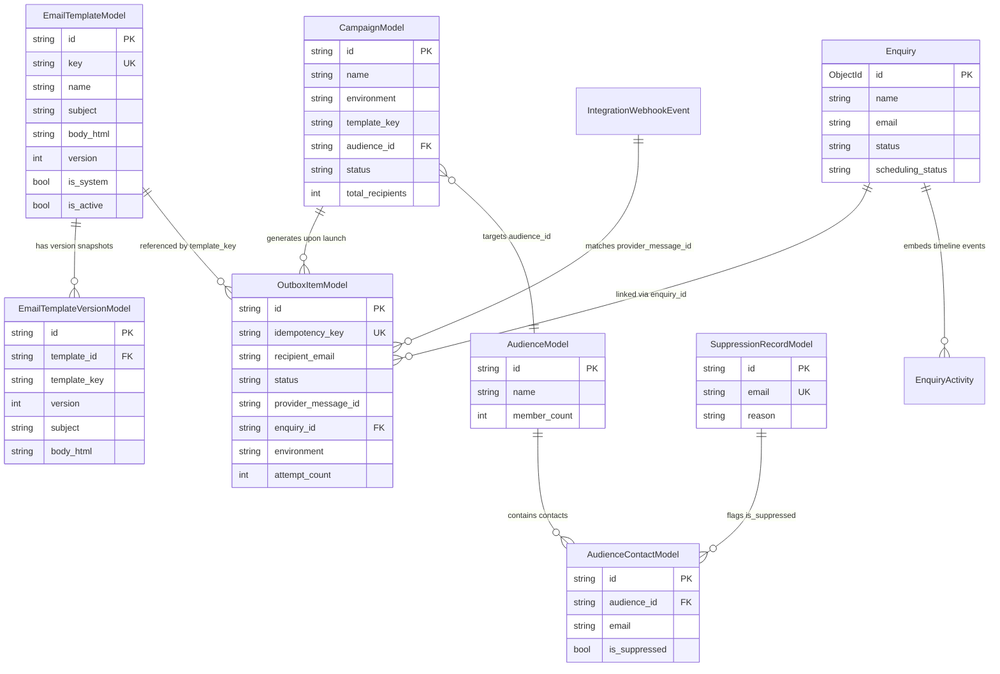
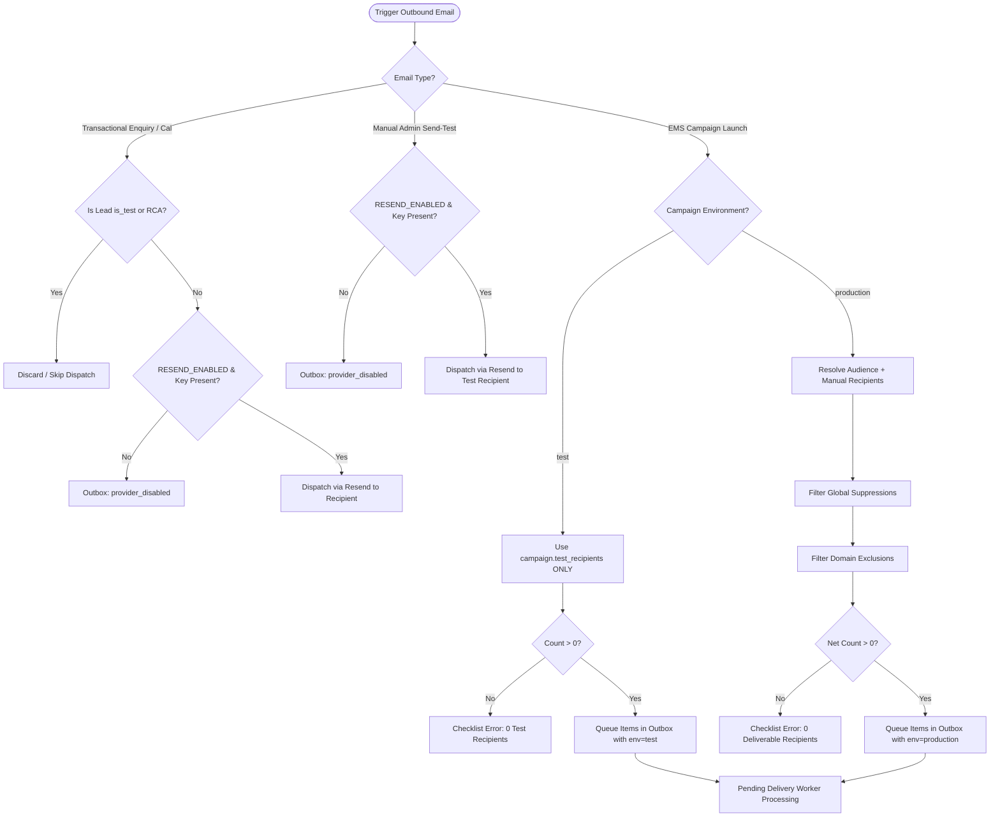
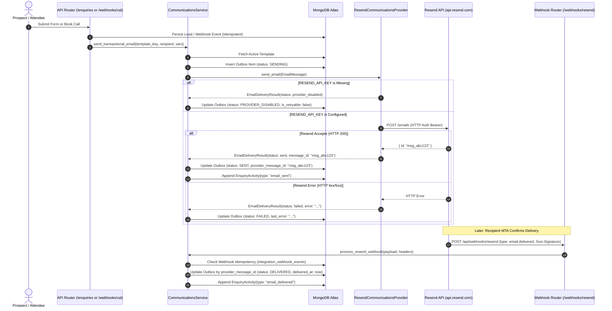
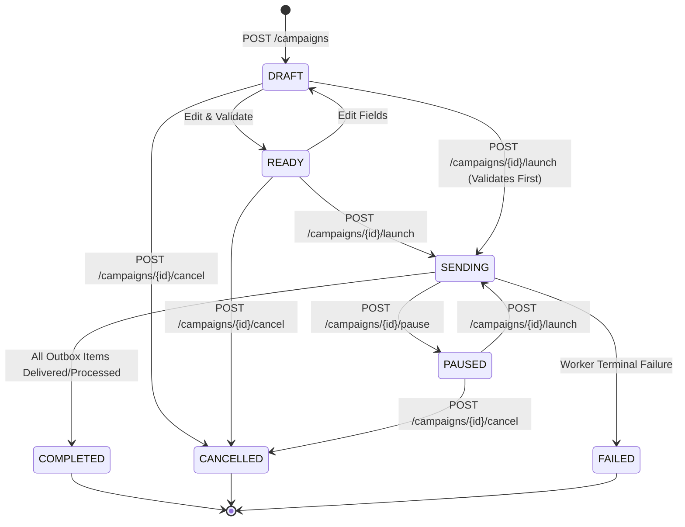
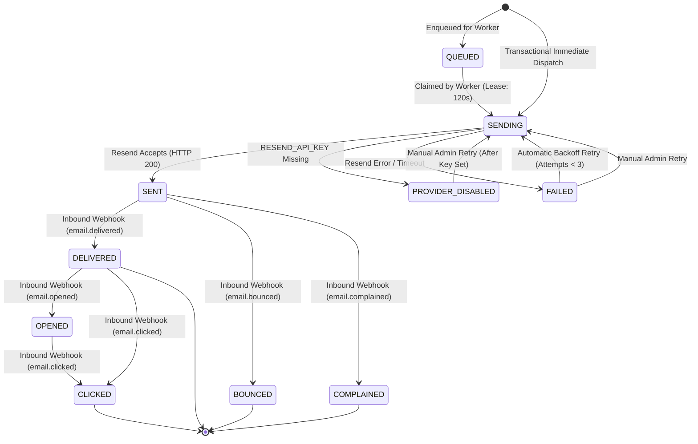
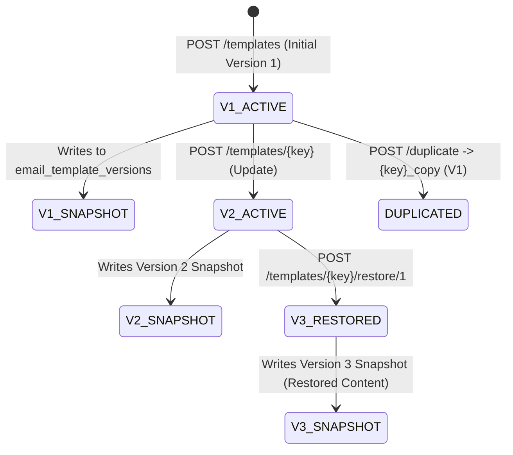

# Communications Centre & Email Management System (EMS) — Current State Forensic Audit & Architecture Baseline

**Document Version**: 1.0.0  
**Audit Date**: August 2026  
**Repository**: `psa-kingdom/Navigatte`  
**Classification**: Engineering & Product Discovery / Forensic Baseline  
**Scope**: Complete reverse-engineering of all Communications, Outbox, Templates, Campaigns, Audiences, Suppressions, Resend Integrations, Webhooks, Delivery Workers, Admin UI, and Security Controls.

---

## TABLE OF CONTENTS
1. [The Big Picture & System Definition](#1-the-big-picture--system-definition)
2. [Complete Repository Map & Dependency Architecture](#2-complete-repository-map--dependency-architecture)
3. [Data Model & Database Audit](#3-data-model--database-audit)
4. [Environment Model: Test vs. Production](#4-environment-model-test-vs-production)
5. [Transactional Email Flows & Sequence Traces](#5-transactional-email-flows--sequence-traces)
6. [Manual Test Email Dispatch Flow](#6-manual-test-email-dispatch-flow)
7. [Outbox & Delivery Engine Architecture](#7-outbox--delivery-engine-architecture)
8. [Resend Integration & Provider Adapter](#8-resend-integration--provider-adapter)
9. [Template Management & Versioning System](#9-template-management--versioning-system)
10. [Campaign Lifecycle Engine](#10-campaign-lifecycle-engine)
11. [Audience & Suppression Engine](#11-audience--suppression-engine)
12. [Campaign Safety Gates & Mass-Send Protections](#12-campaign-safety-gates--mass-send-protections)
13. [Analytics & Telemetry Calculations](#13-analytics--telemetry-calculations)
14. [Audit Trail & Operational Observability](#14-audit-trail--operational-observability)
15. [Admin UI & UX Interaction Audit](#15-admin-ui--ux-interaction-audit)
16. [Visual Design & Aesthetic Audit](#16-visual-design--aesthetic-audit)
17. [Frontend ↔ Backend Contract & API Mapping](#17-frontend--backend-contract--api-mapping)
18. [Security, Authorization & Vulnerability Assessment](#18-security-authorization--vulnerability-assessment)
19. [Comprehensive Failure Matrix](#19-comprehensive-failure-matrix)
20. [State Machines (Mermaid Diagrams)](#20-state-machines)
21. [Product Gap Analysis Matrix](#21-product-gap-analysis-matrix)
22. [Comparison-Ready Architecture Specification](#22-comparison-ready-architecture-specification)
23. [Engineering View vs. Admin/Product View](#23-engineering-view-vs-adminproduct-view)
24. [Final Executive Report (20-Point Analysis)](#24-final-executive-report)

---

## 1. THE BIG PICTURE & SYSTEM DEFINITION

### What Problem Is It Designed to Solve?
The Communications Centre in Navigatte was built to serve two core business purposes:
1. **Automated Transactional Dispatch & Lead Feedback**: Automatically send branded email acknowledgements when prospective enterprise clients submit contact enquiries via `POST /api/enquiries`, and confirmation/reschedule/cancellation notices when prospects book calendar meetings via Cal.com (`POST /api/webhooks/cal`).
2. **Admin Operational Control Plane & Campaign Broadcast Studio**: Provide administrators with a dashboard inside the Admin Command Center to author custom templates, inspect outbound delivery statuses, view real-time delivery/open/bounce analytics, manage global suppressions, import recipient contacts, and draft or launch marketing/advisory email campaigns.

### System Type Classification
The system is currently a **hybrid Operational Delivery Console and Transactional Engine with a Domain-Level Campaign Skeleton**:
- **Transactional Email**: Fully implemented, synchronous inline queuing and dispatch with automatic CRM timeline correlation.
- **Operational Delivery Console**: Fully implemented outbox inspection table, manual message retrying, delivery state monitoring, and live diagnostic health tests.
- **Template Manager**: Implemented database CRUD with immutable version snapshotting and variable substitution.
- **Campaign Management / Email Marketing Platform**: **Partially implemented**. Campaign models, pre-flight launch checklists, recipient resolution, and outbox batch generation are fully coded, but **no continuous background worker daemon runs in production** to asynchronously process the queued campaign items.

### System Boundaries
```
┌─────────────────────────────────────────────────────────────────────────────┐
│                            NAVIGATTE PLATFORM                               │
│                                                                             │
│  ┌───────────────────────┐             ┌─────────────────────────────────┐  │
│  │   Public Marketing    │             │      Admin Command Center       │  │
│  │   - Website Contact   │             │   - Communications Studio       │  │
│  │   - Qualification Form│             │   - Template Manager            │  │
│  │   - Cal.com Booking   │             │   - Audience & Suppression      │  │
│  └──────────┬────────────┘             └────────────────┬────────────────┘  │
│             │                                           │                   │
│             ▼                                           ▼                   │
│  ┌───────────────────────────────────────────────────────────────────────┐  │
│  │                     COMMUNICATIONS CONTROL PLANE                      │  │
│  │                                                                       │  │
│  │  - CommunicationsService      - CampaignService       - DeliveryWorker│  │
│  │  - Template Versioning        - Global Suppression    - Audit Logger  │  │
│  └──────────────────┬───────────────────────────┬────────────────────────┘  │
│                     │                           │                           │
│                     ▼                           ▼                           │
│          ┌─────────────────────┐     ┌───────────────────────┐              │
│          │ MongoDB Collections │     │ Resend Provider Client│              │
│          │ (Outbox/Templates/  │     │ (REST API v1 + Svix   │              │
│          │  Audiences/Events)  │     │  Webhook Ingestion)   │              │
│          └─────────────────────┘     └──────────┬────────────┘              │
└─────────────────────────────────────────────────┼───────────────────────────┘
                                                  │ (HTTPS / TLS)
                                                  ▼
                                       ┌─────────────────────┐
                                       │   api.resend.com    │
                                       │   (External MTA)    │
                                       └─────────────────────┘
```

### What Systems Does It Depend On?
1. **MongoDB Atlas Cluster**: Source of truth for templates, immutable versions, outbox records, campaigns, audience lists, contacts, suppression records, webhook event logs, and audit logs.
2. **Resend API (`https://api.resend.com`)**: Third-party outbound email delivery service responsible for actual SMTP dispatch to recipient mail servers.
3. **Cal.com v2 Webhook API**: External scheduling platform triggering meeting booking lifecycle events.
4. **Svix Webhook Delivery Service**: Resend's signature infrastructure sending webhook notifications (`email.delivered`, `email.bounced`, etc.).
5. **FastAPI ASGI Server / Railway**: Application host providing request routing and database connections.

### What Systems Depend On It?
1. **Enquiries / Lead CRM Router (`routers/enquiries.py`)**: Directly calls `CommunicationsService.send_transactional_email()` when a lead is created.
2. **Scheduling Domain Service (`services/scheduling_service.py`)**: Directly calls `CommunicationsService.send_transactional_email()` on Cal.com calendar events.
3. **Admin Command Center UI (`CommunicationsCentre.jsx`)**: Depends on Communications API routes for managing outbox, campaigns, audiences, and templates.

### Data Ownership vs. Data Reference
| Entity | Ownership Status | Storage Location | Notes |
|---|---|---|---|
| **Email Templates** | Authoritative Owner | `db.email_templates` | Owned by Communications domain |
| **Template Versions** | Authoritative Owner | `db.email_template_versions` | Immutable snapshots owned by domain |
| **Outbox Items** | Authoritative Owner | `db.email_outbox` | Durable log of every outbound dispatch |
| **Campaigns** | Authoritative Owner | `db.campaigns` | Campaign definitions and metrics |
| **Audiences & Contacts** | Authoritative Owner | `db.audiences`, `db.audience_contacts` | Contact lists owned by Communications |
| **Global Suppression** | Authoritative Owner | `db.email_suppressions` | Authoritative blacklist for unsubscribes/bounces |
| **Audit Logs** | Authoritative Owner | `db.communications_audit_logs` | Administrative action trail |
| **Enquiries (Leads)** | Referenced | `db.enquiries` | Owned by CRM domain; referenced via `enquiry_id` |
| **Calendar Bookings** | Referenced | Embedded in `db.enquiries.booking` | Ingested via webhook from Cal.com |

### Concise Current Communications Centre Definition
> **"The Navigatte Communications Centre is a FastAPI/MongoDB/React email operations engine featuring transactional lead acknowledgements, Cal.com scheduling confirmations, template version snapshots, global suppression filtering, Resend REST v1 dispatch, and Svix webhook tracking; its campaign broadcast layer generates durable outbox records, but currently relies on an offline worker architecture rather than an automatic in-process daemon."**

---

## 2. COMPLETE REPOSITORY MAP & DEPENDENCY ARCHITECTURE

### File Inventory

#### Frontend (`frontend/src/`)
- `components/admin/communications/CommunicationsCentre.jsx` (71 KB): Monolithic React 19 component containing all 6 EMS sub-tabs, modals, campaign composer, outbox viewer, template manager, and audience tools.
- `config/adminNavigationConfig.js`: Registers the "Communications" navigation entry under "Content & Growth" with id `communications`.
- `pages/admin/AdminCommandCenterPage.jsx`: Renders `CommunicationsCentre` when `activeTab === "communications"`.
- `components/admin/settings/IntegrationsTab.jsx`: Displays Resend provider readiness status, sending domain (`updates.navigatte.com`), and configuration health.
- `components/admin/settings/SystemHealthTab.jsx`: Provides live connectivity test actions (`POST /api/admin/system/health/resend/test`).

#### Backend Routers (`backend/routers/`)
- `communications.py` (22.8 KB): Outbox listing, template CRUD, template versioning, preview, duplicate, restore, single outbox inspection, retry action, manual test dispatch (`/send-test`), analytics, and diagnostics.
- `campaigns.py` (13.1 KB): Campaign CRUD, pre-flight checklist validation (`/validate`), launch execution (`/launch`), recipient calculation (`/calculate-recipients`), pause, and cancellation.
- `audiences.py` (11.5 KB): Audience CRUD, single contact creation, bulk CSV import (`/import`), and global suppression CRUD (`/suppression`).
- `webhooks.py` (5.3 KB): Public signature-verified ingestion endpoints `POST /api/webhooks/resend` (Svix) and `POST /api/webhooks/cal` (HMAC-SHA256).
- `enquiries.py` (8.4 KB): Public lead intake triggering `enquiry_acknowledgement` email.
- `integrations.py` (3.5 KB): Operational integration status overview.
- `system_health.py` (6.6 KB): Real-time diagnostic ping tests for Resend, MongoDB, and Cal.com.

#### Backend Services (`backend/services/`)
- `communications_service.py` (19.9 KB): Core template rendering, transactional email dispatch, error classification, retry logic, and Resend webhook processing with CRM timeline sync.
- `delivery_worker.py` (8.8 KB): Atomic MongoDB claim/lock queue engine (`find_one_and_update`), exponential backoff retry calculator, and batch processor.
- `campaign_service.py` (12.7 KB): Campaign recipient calculation, exclusion checking, suppression filtering, pre-flight checklist validation, and outbox batch creation.
- `scheduling_service.py` (16.5 KB): Cal.com webhook processing triggering confirmation, reschedule, and cancellation transactional emails.
- `health_service.py` (15.0 KB): Telemetry health checks for Resend API connectivity and outbox queue health.
- `seeder.py` (7.9 KB): Database seeder (seeds admin and projects; template seeding is delegated to `CommunicationsService.ensure_default_templates`).

#### Backend Models (`backend/models/`)
- `communications.py`: `EmailTemplateModel`, `OutboxItemModel`, `OutboxStatus`.
- `campaign.py`: `CampaignModel`, `CampaignStatus`.
- `audience.py`: `AudienceModel`, `AudienceContactModel`, `SuppressionRecordModel`.
- `template_version.py`: `EmailTemplateVersionModel`.
- `audit.py`: `CommunicationsAuditLogModel`.
- `webhook_event.py`: `IntegrationWebhookEvent`, `WebhookProcessingStatus`.
- `system_health.py`: `IntegrationHealthRecord`, `SystemHealthOverview`, `HealthStatus`.
- `enquiry.py`: `Enquiry`, `EnquiryActivity`, `BookingSummary`.

#### Integrations & Contracts (`backend/integrations/`)
- `contracts/communications.py`: Abstract Base Class `CommunicationsProvider`, `EmailMessage`, `EmailRecipient`, `EmailDeliveryResult`, `CommunicationWebhookEvent`, `CommunicationEventType`.
- `resend/provider.py`: Concrete `ResendCommunicationsProvider` adapter.
- `resend/client.py`: Asynchronous REST client for `https://api.resend.com` using `httpx`. Includes `_clean_resend_tag()` ASCII sanitizer.
- `resend/verifier.py`: Svix HMAC-SHA256 webhook signature validator.
- `resend/mapper.py`: Translates raw Resend webhook payloads into normalized domain events.

#### Configuration & Environment
- `core/config.py`: Centralized Pydantic settings loading `RESEND_API_KEY`, `RESEND_ENABLED`, `RESEND_FROM_EMAIL`, `RESEND_WEBHOOK_SECRET`, `COMMUNICATIONS_ENVIRONMENT`, `ALLOWED_TEST_RECIPIENTS`.
- `.env.example`: Template environment variable declarations.
- `Procfile`: `web: uvicorn server:app --host 0.0.0.0 --port $PORT` (Single web process; no secondary worker process declared).

#### Tests (`backend/tests/`)
- `test_communications.py` (18.0 KB): 10 test cases covering overview, templates, test send, diagnostics, webhook ingestion, CRM timeline sync, public enquiry trigger, Cal.com triggers, retry guards.
- `test_ems_full.py` (17.2 KB): 10 test cases covering template versioning, audience suppressions, test isolation, delivery worker claiming, audit logs, analytics, tag sanitization, CSV import, exclusions, and drafts.
- `test_resend_integration.py` (4.4 KB): 4 test cases covering provider disabled fallback, signature verification, event mapping, and status reporting.

---

## 3. DATA MODEL & DATABASE AUDIT

### Entity Breakdown

#### 1. `EmailTemplateModel`
- **Collection**: `email_templates`
- **Purpose**: Authoring and runtime storage of active email templates.
- **Fields**:
  - `_id` / `id` (`str`, UUIDv4, Required): Primary Key.
  - `key` (`str`, Required): Unique slug identifier (e.g. `enquiry_acknowledgement`).
  - `name` (`str`, Required): Human-readable display name.
  - `category` (`str`, Required, Default: `"transactional"`): `"transactional"` | `"campaign"` | `"system"`.
  - `subject` (`str`, Required): Subject line supporting `{{ var }}` syntax.
  - `body_html` (`str`, Required): Full HTML email body supporting `{{ var }}` syntax.
  - `body_text` (`str`, Optional, Default: `None`): Plain text alternative.
  - `variables` (`List[str]`, Required, Default: `[]`): Declared variable schema (e.g. `["name", "company"]`).
  - `version` (`int`, Required, Default: `1`): Current monotonically increasing version counter.
  - `is_active` (`bool`, Required, Default: `True`): Activation state.
  - `is_system` (`bool`, Required, Default: `False`): System protection flag; prevents deletion if `True`.
  - `provider` (`str`, Required, Default: `"navigatte"`): Provider identifier (`"navigatte"` | `"resend"`).
  - `provider_template_id` (`str`, Optional, Default: `None`): Unused vendor template ID.
  - `created_at` (`datetime`, UTC, Default: `now`): Creation timestamp.
  - `updated_at` (`datetime`, UTC, Default: `now`): Last update timestamp.
  - `created_by` (`str`, Optional): Admin email who created the record.
  - `updated_by` (`str`, Optional): Admin email who last updated the record.
- **Indexes**: None declared in application code (relies on MongoDB default `_id_`).
- **Lifecycle**: Created via seeder or `POST /templates`; updated via `POST /templates/{key}`; soft/hard deleted via `DELETE /templates/{key}`.

#### 2. `EmailTemplateVersionModel`
- **Collection**: `email_template_versions`
- **Purpose**: Immutable historical version snapshots of templates.
- **Fields**:
  - `_id` / `id` (`str`, UUIDv4, Required): Primary Key.
  - `template_id` (`str`, Required): Foreign key to `email_templates._id`.
  - `template_key` (`str`, Required): Template slug.
  - `version` (`int`, Required): Snapshot version number.
  - `name` (`str`, Required): Name at snapshot time.
  - `subject` (`str`, Required): Subject at snapshot time.
  - `body_html` (`str`, Required): HTML at snapshot time.
  - `body_text` (`str`, Optional): Text at snapshot time.
  - `variables` (`List[str]`, Required, Default: `[]`): Variable schema at snapshot time.
  - `created_at` (`datetime`, UTC, Default: `now`): Timestamp of version creation.
  - `created_by` (`str`, Optional): Admin who created the snapshot.
  - `change_summary` (`str`, Optional): Description of modification.
- **Indexes**: None declared in application code.

#### 3. `OutboxItemModel`
- **Collection**: `email_outbox`
- **Purpose**: Durable log and queue item for every outbound email dispatch.
- **Fields**:
  - `_id` / `id` (`str`, UUIDv4, Required): Primary Key.
  - `idempotency_key` (`str`, Required): Deduplication key (e.g. `email:enquiry_acknowledgement:<id>`).
  - `template_key` (`str`, Optional): Template used.
  - `recipient_email` (`EmailStr`, Required): Target email address.
  - `recipient_name` (`str`, Optional): Recipient display name.
  - `subject` (`str`, Required): Rendered subject.
  - `body_html` (`str`, Required): Rendered HTML body.
  - `body_text` (`str`, Optional): Rendered text body.
  - `from_email` (`str`, Required, Default: `"Navigatte <updates@updates.navigatte.com>"`): Sender header.
  - `status` (`OutboxStatus`, Required, Default: `QUEUED`): `"queued"`, `"sending"`, `"sent"`, `"delivered"`, `"bounced"`, `"complained"`, `"failed"`, `"opened"`, `"clicked"`, `"provider_disabled"`.
  - `provider` (`str`, Required, Default: `"resend"`): Delivery vendor.
  - `provider_message_id` (`str`, Optional): Vendor ID returned by Resend (e.g. `msg_12345`).
  - `enquiry_id` (`str`, Optional): Foreign key to `enquiries._id` if linked to CRM lead.
  - `error_message` (`str`, Optional): Sanitized error explanation.
  - `attempt_count` (`int`, Required, Default: `0`): Number of dispatch attempts.
  - `max_attempts` (`int`, Required, Default: `3`): Maximum allowed retry attempts.
  - `next_attempt_at` (`datetime`, Optional): Exponential backoff scheduled time.
  - `lock_expires_at` (`datetime`, Optional): Atomic worker lease expiry timestamp.
  - `last_error` (`str`, Optional): Raw error message from last failed attempt.
  - `is_retryable` (`bool`, Required, Default: `True`): Whether error is transient.
  - `environment` (`str`, Required, Default: `"test"`): `"test"` | `"production"`.
  - `tags` (`Dict[str, str]`, Required, Default: `{}`): Metadata tags sent to Resend (e.g. `campaign_id`).
  - `metadata` (`Dict[str, Any]`, Required, Default: `{}`): Arbitrary contextual parameters.
  - `created_at` (`datetime`, UTC, Default: `now`).
  - `sent_at`, `delivered_at`, `opened_at`, `clicked_at`, `failed_at`, `bounced_at`, `complained_at` (`datetime`, Optional): Event timestamps.
  - `updated_at` (`datetime`, UTC, Default: `now`).
- **Indexes**: Missing unique index on `idempotency_key` and missing compound indexes for worker queue queries.

#### 4. `CampaignModel`
- **Collection**: `campaigns`
- **Purpose**: Email marketing / outreach initiative container.
- **Fields**:
  - `_id` / `id` (`str`, UUIDv4, Required): Primary Key.
  - `name` (`str`, Required): Campaign title.
  - `description` (`str`, Optional): Internal description.
  - `environment` (`str`, Required, Default: `"test"`): `"test"` | `"production"`.
  - `sender_email` (`str`, Required, Default: `"Navigatte <updates@updates.navigatte.com>"`).
  - `reply_to` (`str`, Optional): Reply-to header address.
  - `subject` (`str`, Required): Subject line.
  - `template_key` (`str`, Required): Slug of template or `"custom"`.
  - `template_version` (`int`, Required, Default: `1`).
  - `audience_id` (`str`, Optional): Foreign key to `audiences._id`.
  - `audience_source` (`str`, Required, Default: `"audience"`): `"newsletter"` | `"manual"` | `"both"` | `"audience"`.
  - `manual_recipients` (`List[str]`, Required, Default: `[]`): Array of raw email strings.
  - `exclusions` (`List[str]`, Required, Default: `[]`): Excluded email addresses or domains (`@domain.com`).
  - `custom_html` (`str`, Optional): Authored HTML body if overriding template.
  - `status` (`CampaignStatus`, Required, Default: `DRAFT`): `"draft"`, `"ready"`, `"scheduled"`, `"sending"`, `"paused"`, `"cancelled"`, `"completed"`, `"failed"`.
  - `test_recipients` (`List[EmailStr]`, Required, Default: `[]`): Allowed recipients when `environment == "test"`.
  - `total_recipients`, `sent_count`, `delivered_count`, `bounced_count`, `opened_count`, `clicked_count`, `complained_count`, `failed_count` (`int`, Default: `0`): Aggregated metrics.
  - `scheduled_at`, `launched_at`, `completed_at` (`datetime`, Optional): Lifecycle timestamps.
  - `created_at`, `updated_at` (`datetime`, UTC, Default: `now`).
  - `created_by` (`str`, Optional): Admin email.
  - `launch_checklist` (`Dict[str, Any]`, Required, Default: `{}`): Snapshot of pre-flight validation evaluation.

#### 5. `AudienceModel` & `AudienceContactModel`
- **Collections**: `audiences`, `audience_contacts`
- **Fields (`AudienceModel`)**: `_id` (`str`), `name` (`str`), `description` (`str`), `tags` (`List[str]`), `member_count` (`int`), `created_at`, `updated_at`, `created_by`.
- **Fields (`AudienceContactModel`)**: `_id` (`str`), `audience_id` (`str`), `email` (`EmailStr`), `name` (`str`), `company` (`str`), `attributes` (`Dict[str, Any]`), `is_suppressed` (`bool`), `created_at`.

#### 6. `SuppressionRecordModel`
- **Collection**: `email_suppressions`
- **Purpose**: Global blacklist suppressing all future campaign dispatches to a specific address.
- **Fields**: `_id` (`str`), `email` (`EmailStr`), `reason` (`str`: `"unsubscribed"` | `"hard_bounce"` | `"complaint"` | `"manual"`), `source` (`str`), `created_at`, `created_by`.

#### 7. `CommunicationsAuditLogModel`
- **Collection**: `communications_audit_logs`
- **Fields**: `_id` (`str`), `actor_email` (`str`), `action` (`str`), `target_type` (`str`), `target_id` (`str`), `environment` (`str`), `details` (`Dict[str, Any]`), `created_at`.

### Entity-Relationship Diagram (Mermaid)



### Data Model Inconsistencies & Weaknesses
1. **Primary Key Inconsistency**: Core collections (`enquiries`, `projects`, `admin_users`) inherit from `BaseDocument` using MongoDB `ObjectId`. Communications models (`EmailTemplateModel`, `OutboxItemModel`, `CampaignModel`, etc.) use UUIDv4 strings stored in `_id`.
2. **Missing Database Indexes**: The repository does not execute any `create_index` calls on startup for Communications collections. Specifically missing:
   - `email_outbox.idempotency_key` (Unique)
   - `email_outbox.provider_message_id`
   - `email_outbox.status` + `next_attempt_at` (Compound index for delivery queue)
   - `email_suppressions.email` (Unique)
   - `audience_contacts.audience_id` + `audience_contacts.email` (Compound unique)
3. **Ambiguous `audience_source` Values**: `CampaignModel.audience_source` allows `"newsletter"`, but there is no `newsletters` or `subscribers` collection in MongoDB. The backend treats `"newsletter"` as having 0 contacts unless an `audience_id` is supplied.
4. **Disconnection Between Bounces and Global Suppression**: Inbound webhooks update outbox items to `bounced` or `complained`, but do **NOT** automatically insert records into `db.email_suppressions`.

---

## 4. ENVIRONMENT MODEL: TEST VS. PRODUCTION

### Configuration Matrix
| Environment Setting | Variable Source | Default Value | Purpose |
|---|---|---|---|
| `COMMUNICATIONS_ENVIRONMENT` | `os.getenv("COMMUNICATIONS_ENVIRONMENT")` | `"production"` if `ENVIRONMENT=production` else `"test"` | Controls campaign launch rules and outbox environment tagging |
| `RESEND_ENABLED` | Inferred or `os.getenv("RESEND_ENABLED")` | Auto-inferred (`True` if `RESEND_API_KEY` is present) | Master kill switch for outbound email dispatch |
| `RESEND_API_KEY` | `os.getenv("RESEND_API_KEY")` | `None` | Authentication bearer token for Resend REST API |
| `RESEND_FROM_EMAIL` | `os.getenv("RESEND_FROM_EMAIL")` | `"Navigatte <updates@updates.navigatte.com>"` | Sender email address header |
| `RESEND_WEBHOOK_SECRET` | `os.getenv("RESEND_WEBHOOK_SECRET")` | `None` | Svix HMAC-SHA256 signature secret (`whsec_...`) |
| `ALLOWED_TEST_RECIPIENTS` | `os.getenv("ALLOWED_TEST_RECIPIENTS")` | `[]` (Array from comma-separated string) | Configured allowed recipients in test mode |

### Test Mode Deep-Dive
- **What Can Be Sent?**:
  - Campaigns in Test Mode: Restricted **strictly** to the `test_recipients` array defined on the campaign.
  - Manual Test Emails (`/send-test`): Dispatches directly to the requested recipient.
  - Transactional Emails (Enquiries & Bookings): Dispatches directly to the prospect email unless marked with `is_test: true` or prefixed with `rca_verification_test@`.
- **Accidental Send Risk in Test Mode**:
  > [!WARNING]
  > `CommunicationsService.send_transactional_email()` does **NOT** check `ALLOWED_TEST_RECIPIENTS`. If a real user submits the public contact form on a test environment where `RESEND_API_KEY` is configured, a real email **WILL** be sent to that user. Only diagnostic leads (`is_test: true`) are skipped.
- **Database & Domain Isolation**:
  - The database is **shared** (determined by `MONGO_URL` / `DB_NAME`).
  - The Resend account and sending domain (`updates.navigatte.com`) are **shared** between test and production.
  - Outbox records have an `environment: "test" | "production"` field.

### Production Mode Deep-Dive
- **What Changes?**:
  - Campaign launch validates that `campaign.environment == "production"`.
  - Recipient resolution pulls from `audience_contacts`, deduplicates with manual lists, removes addresses matching `email_suppressions`, and removes addresses matching `exclusions`.
- **Accidental Mass-Send Protections**:
  - Pre-flight checklist blocks launch if target count is 0, subject is empty, or provider is disabled.
  - Exclusions filter out internal or test domains (e.g. `@navigatte.com`).
  - Global suppression list filters out previously bounced or unsubscribed users.

### Environment Flow Diagram (Mermaid)



---

## 5. TRANSACTIONAL EMAIL FLOWS & SEQUENCE TRACES

### Flow 1: Public Enquiry Submission
1. **Trigger**: Prospect submits `POST /api/enquiries`.
2. **Persistence**: Ingested into `db.enquiries` with status `new`.
3. **Bot Guard**: If honeypot `website_hp` is populated, discarded silently.
4. **Diagnostic Guard**: If email starts with `rca_verification_test@`, tagged `is_test: true` and email trigger is skipped.
5. **Dispatch**: Invokes `CommunicationsService.send_transactional_email(template_key="enquiry_acknowledgement")`.
6. **Template**: Fetches `enquiry_acknowledgement` from `db.email_templates`. If unseeded, falls back to generic string `<p>Notification for {name}</p>`.
7. **Outbox**: Creates item with `status="sending"`, dispatches via `ResendCommunicationsProvider.send_email()`.
8. **Result**:
   - If Resend responds HTTP 200: Outbox updated to `status="sent"`, `provider_message_id="msg_..."`.
   - If unconfigured: Outbox updated to `status="provider_disabled"`, error recorded.
   - If Resend error: Outbox updated to `status="failed"`, classified as transient vs. permanent.
9. **CRM Timeline**: On `status="sent"`, appends `EnquiryActivity(type="email_sent")` to `enquiry.activities`.

### Flow 2: Consultation Booking Created (Cal.com)
1. **Trigger**: Cal.com dispatches `BOOKING_CREATED` webhook to `POST /api/webhooks/cal`.
2. **Signature Verification**: Validates `x-cal-signature-256` HMAC-SHA256 against raw body bytes.
3. **Idempotency**: Ingests into `db.integration_webhook_events` with unique key `cal:BOOKING_CREATED:<uid>:<timestamp>`.
4. **CRM Lead Match**: Matches existing enquiry by normalized email address or creates new enquiry (`source="cal.com"`). Advances status to `contacted`.
5. **Dispatch**: Invokes `CommunicationsService.send_transactional_email(template_key="consultation_booking_confirmation")`.
6. **Idempotency Key**: `email:booking_created:<uid>`.

### Flow 3: Consultation Rescheduled
1. **Trigger**: Cal.com dispatches `BOOKING_RESCHEDULED` webhook.
2. **CRM Update**: Updates `scheduling_status="rescheduled"` and appends `EnquiryActivity(type="booking_rescheduled")`.
3. **Dispatch**: Invokes `send_transactional_email(template_key="consultation_rescheduled")` with new start time and video meeting URL.
4. **Idempotency Key**: `email:booking_rescheduled:<uid>:<timestamp>`.

### Flow 4: Consultation Cancelled / Rejected
1. **Trigger**: Cal.com dispatches `BOOKING_CANCELLED` or `BOOKING_REJECTED`.
2. **CRM Update**: Updates `scheduling_status="cancelled"` and logs cancellation reason note.
3. **Dispatch**: Invokes `send_transactional_email(template_key="consultation_cancelled")`.
4. **Idempotency Key**: `email:booking_cancelled:<uid>`.

### Sequence Diagram: Transactional Email & Webhook Loop (Mermaid)



---

## 6. MANUAL TEST EMAIL DISPATCH FLOW

### Step-by-Step Flow
1. **Admin Action**: Admin navigates to Communications Studio, selects a template (or custom HTML), enters recipient email, and clicks "Send Test Email".
2. **Frontend Request**: `POST /api/admin/communications/send-test` with body:
   ```json
   {
     "recipient_email": "admin@navigatte.com",
     "recipient_name": "Test Administrator",
     "template_key": "enquiry_acknowledgement",
     "variables": { ... }
   }
   ```
3. **Backend Processing**: `send_test_email()` invokes `CommunicationsService.send_transactional_email()`.
4. **Template Lookup**: Queries `db.email_templates.find_one({"key": template_key, "is_active": True})`.
5. **Rendering**: Regex substitution interpolates variables into subject, HTML, and text bodies.
6. **Dispatch & Result Handling**:
   - Provider disabled: Returns `{ "success": false, "status": "provider_disabled", "error_message": "..." }`.
   - Provider error: Returns `{ "success": false, "status": "failed", "error_message": "..." }`.
   - Provider sent: Returns `{ "success": true, "status": "sent", "provider_message_id": "msg_..." }`.
7. **UI Notification**: Displays green toast if `success: true`, or red destructive toast explaining why delivery failed or why the provider is disabled.

### Answers to Specific Audit Questions
- **Can admin select any template?**: Yes, any active template in `db.email_templates`.
- **Can custom templates be tested?**: If `template_key == "custom"`, the backend uses the fallback template string unless authored HTML is passed.
- **Can versioned templates be tested?**: **No**. The endpoint only queries by `key` (active version). Historical version snapshots in `email_template_versions` cannot be passed to `/send-test`.
- **Can Resend-hosted templates be tested?**: **No**. Resend-hosted templates (`provider_template_id`) are not supported by the client.
- **Can rendered variables be supplied?**: Yes, via the `variables` dictionary in the API payload, though the frontend UI currently supplies hardcoded mock values.
- **Can HTML be previewed before sending?**: Yes, the frontend renders a live `<iframe>` using string substitution in React.
- **What does the UI tell the admin?**:
  - If provider key is unset: "Provider Not Configured: RESEND_API_KEY is not set."
  - If accepted: "Test Email Dispatched: Dispatched '...' to ... (Status: sent)."
- **Is "delivered" distinguishable from "accepted by provider"?**: **Yes**. Initial dispatch marks status `sent`. Status only transitions to `delivered` when Resend's inbound Svix webhook fires.

---

## 7. OUTBOX & DELIVERY ENGINE ARCHITECTURE

### Synchronous vs. Asynchronous Behavior
- **Transactional Emails**: **Synchronous inline dispatch**. The HTTP request handler holds the connection while contacting `api.resend.com`.
- **Campaign Broadcasts**: **Asynchronous queueing**. Campaign launch inserts batch documents into `email_outbox` with `status="queued"`.

### Delivery Worker Implementation (`services/delivery_worker.py`)
- **Worker Class**: `DeliveryWorker`
- **Claim Mechanism**: Atomic MongoDB `find_one_and_update` query:
  ```python
  query = {
      "$or": [
          {"status": "queued"},
          {
              "status": "failed",
              "is_retryable": True,
              "attempt_count": {"$lt": 3},
              "$or": [{"next_attempt_at": {"$lte": now}}, {"next_attempt_at": None}],
          },
          {
              "status": "sending",
              "lock_expires_at": {"$lte": now},  # Crash recovery lease expiry
          },
      ]
  }
  ```
- **Concurrency & Locking**: When claimed, the item's status transitions to `sending`, `attempt_count` is incremented by 1, and `lock_expires_at` is set to `now + 120 seconds`. If a worker crashes mid-delivery, the lock expires after 2 minutes and another worker claims it safely.
- **Exponential Backoff**: For retryable transient errors, `next_attempt_at = now + (2 ^ attempt_count * 60 seconds)` (1m, 2m, 4m).
- **Max Attempts**: Capped at `max_attempts = 3`. After 3 attempts, `is_retryable` becomes `False` and the item remains in `failed` status (Dead Letter).

### Critical Operational Discovery: Worker Runtime Status
> [!IMPORTANT]
> **The `DeliveryWorker` is implemented in code and verified by unit tests (`test_durable_delivery_worker_batch_processing`), but IT IS NOT RUNNING AS A BACKGROUND DAEMON OR CRON JOB IN PRODUCTION.**  
> - `server.py` lifespan does not launch a background task.
> - `Procfile` only runs the Uvicorn web process.  
> As a result, campaign items placed into `QUEUED` status stay `QUEUED` unless manually processed or triggered via test scripts.

---

## 8. RESEND INTEGRATION & PROVIDER ADAPTER

### Architecture & Boundaries
```
┌────────────────────────────────────────────────────────────┐
│              integrations/contracts/communications.py       │
│  - CommunicationsProvider (Abstract Base Class)            │
│  - EmailMessage, EmailRecipient, EmailDeliveryResult       │
│  - CommunicationWebhookEvent, CommunicationEventType       │
└─────────────────────────────▲──────────────────────────────┘
                              │ implements
┌─────────────────────────────┴──────────────────────────────┐
│              integrations/resend/provider.py               │
│  - ResendCommunicationsProvider                            │
│  ┌──────────────────────┐      ┌────────────────────────┐  │
│  │ client.py            │      │ verifier.py            │  │
│  │ (Async httpx Client) │      │ (Svix HMAC-SHA256)     │  │
│  └──────────────────────┘      └────────────────────────┘  │
│  ┌──────────────────────────────────────────────────────┐  │
│  │ mapper.py (Translates Resend JSON -> WebhookEvent)   │  │
│  └──────────────────────────────────────────────────────┘  │
└────────────────────────────────────────────────────────────┘
```

### Technical Details
- **API Version**: Resend REST API v1 (`https://api.resend.com/emails`).
- **Dependencies**: Standard library + `httpx>=0.27.0` (zero heavyweight proprietary SDKs).
- **Tag Validation Rule**: Resend enforces ASCII-only alphanumeric characters, underscores, and dashes for tag names and values. `_clean_resend_tag()` strips invalid characters to avoid HTTP 422 rejections.
- **Webhook Verification**: Verifies Svix signatures with `whsec_` base64-decoded keys computed over `{svix-id}.{svix-timestamp}.{raw_body}`.
- **Template Support**: **Navigatte-rendered HTML only**. The system does not dispatch Resend template IDs.

---

## 9. TEMPLATE MANAGEMENT & VERSIONING

### Template Capabilities
- **Creation**: `POST /api/admin/communications/templates` (generates key, initializes version 1, creates snapshot).
- **Editing**: `POST /api/admin/communications/templates/{key}` (increments version, updates main document, writes new record to `email_template_versions`).
- **Version History**: `GET /api/admin/communications/templates/{key}/versions` (retrieves historical snapshots).
- **Version Restoration**: `POST /api/admin/communications/templates/{key}/restore/{version_number}` (loads content from snapshot, creates new incremented version).
- **Duplication**: `POST /api/admin/communications/templates/{key}/duplicate` (copies to `{key}_copy`).
- **System Protection**: `DELETE /api/admin/communications/templates/{key}` blocks deletion if `is_system == True`.

### Product & UX Weaknesses
- **Variable Syntax**: Simple regex `{{ variable }}`. Conditionals (``), loops, and filters are unsupported.
- **Editor**: Plain text area. No rich-text or block drag-and-drop editor.
- **Campaign Immutability**: Campaigns reference `template_key`. If a template is edited after campaign creation, launching the campaign will use the *updated* template unless `custom_html` was saved on the campaign.

---

## 10. CAMPAIGN SYSTEM

### Campaign Lifecycle States


### Pre-Flight Launch Checklist
Evaluated by `CampaignService.validate_launch_checklist()` before launch:
1. **Environment Check**: `campaign.environment == settings.COMMUNICATIONS_ENVIRONMENT`.
2. **Provider Health**: `settings.RESEND_ENABLED == True`.
3. **Content / Template**: Template exists or `custom_html` is populated.
4. **Subject Line**: Subject is non-empty.
5. **Audience Count**: Net deliverable contacts > 0.

### Brutal Assessment
> **The Campaign System is a robust Domain Model & Validation Checklist on top of an offline Outbox Queue. It is not yet a complete automated broadcast system because the background worker is not running to drain the queue.**

---

## 11. AUDIENCE & SUPPRESSION ENGINE

### Implemented Capabilities
- **Audience Groups**: Create, list, delete audience records (`db.audiences`).
- **Contact Assignment**: Add individual contacts with custom attributes (`db.audience_contacts`).
- **Bulk CSV Import**: `POST /api/admin/communications/audiences/{id}/import` parses contact rows, checks syntax, excludes duplicates in batch, checks global suppression, and returns validation reports.
- **Global Suppression**: `db.email_suppressions` stores unsubscribed, bounced, and complained emails.
- **Suppression Filtering**: When resolving campaign recipients, any address in `db.email_suppressions` is automatically excluded.

### Missing Capabilities
- **Excel Import**: No `.xlsx` parser in backend.
- **Public Unsubscribe Handler**: No public `/api/unsubscribe` endpoint exists to allow recipients to opt out with one click.
- **Automated Bounce Suppression**: Inbound bounce webhooks do not automatically create `SuppressionRecordModel` entries.
- **Dynamic Audience Segmentation**: No query builder for filtering contacts by attributes.

---

## 12. CAMPAIGN SAFETY GATES & MASS-SEND PROTECTIONS

| Safety Mechanism | Implementation Status | Protection Provided | Missing / Weakness |
|---|---|---|---|
| **Test Mode Recipient Boundary** | IMPLEMENTED | Restricts campaign dispatches strictly to `campaign.test_recipients` | Transactional emails do not enforce `ALLOWED_TEST_RECIPIENTS` |
| **Pre-Flight Validation Checklist** | IMPLEMENTED | Blocks launch if environment mismatches, provider disabled, or audience is 0 | Does not check Resend domain verification status |
| **Global Suppression Filtering** | IMPLEMENTED | Automatically removes suppressed emails from campaign queue | Webhook bounces do not automatically add suppressions |
| **Domain & Email Exclusions** | IMPLEMENTED | Excludes `@domain.com` or specific addresses | No regex pattern matching for complex domains |
| **Double-Launch Locking** | PARTIALLY IMPLEMENTED | Rejects launch if status is not `draft`, `ready`, or `paused` | No atomic database lock on campaign launch status |
| **Outbox Idempotency** | IMPLEMENTED | Deterministic key `campaign:<id>:<email>` prevents duplicate queuing | None |
| **Rate Limiting / Throttling** | MISSING | None | Resend API rate limits (e.g. 10 req/sec) could be exceeded |

---

## 13. ANALYTICS & TELEMETRY CALCULATIONS

### Metric Formulas (`GET /api/admin/communications/analytics`)
- **Total Outbox**: `count_documents({})`
- **Sent Count**: `count_documents({"status": {"$in": ["sent", "delivered", "opened", "clicked"]}})`
- **Delivered Count**: `count_documents({"status": {"$in": ["delivered", "opened", "clicked"]}})`
- **Opened Count**: `count_documents({"status": {"$in": ["opened", "clicked"]}})`
- **Clicked Count**: `count_documents({"status": "clicked"})`
- **Bounced Count**: `count_documents({"status": "bounced"})`
- **Delivery Rate**: `(delivered_count / sent_count) * 100` (Guarded: `0.0` if `sent == 0`)
- **Open Rate**: `(opened_count / delivered_count) * 100` (Guarded: `0.0` if `delivered == 0`)
- **Click Rate**: `(clicked_count / opened_count) * 100` (Guarded: `0.0` if `opened == 0`)
- **Bounce Rate**: `(bounced_count / sent_count) * 100` (Guarded: `0.0` if `sent == 0`)

### Reliability Assessment
- All metrics are calculated via real-time MongoDB queries across `email_outbox`.
- Mathematical division-by-zero guards are properly implemented.
- **Weakness**: Campaign-level roll-up metrics (`campaign.delivered_count`, etc.) are not updated incrementally when webhooks arrive.

---

## 14. AUDIT TRAIL & OPERATIONAL OBSERVABILITY

### What an Admin Can Inspect
- **Action Logs (`db.communications_audit_logs`)**: Captures `campaign_created`, `campaign_launched`, `audience_contacts_imported`, `suppression_added`, `suppression_removed`.
- **Outbox Inspection**: View recipient, rendered subject/body, provider message ID, error message, attempt count, and timestamps.
- **Manual Retry Action**: Retries failed or provider-disabled dispatches with max-attempt and delivered guards.

### Missing Observability
- Transactional email dispatches do not write to `communications_audit_logs`.
- Template edits and restorations do not write to `communications_audit_logs`.
- Individual attempt logs (timestamps and errors of attempts 1, 2, 3) are not stored as an attempt history subdocument array.

---

## 15. ADMIN UI & UX INTERACTION AUDIT

### Sub-Tab Breakdown (`CommunicationsCentre.jsx`)
1. **Campaign Studio (Composer)**:
   - Mode Toggle (Test vs. Production).
   - Campaign Title input.
   - Audience source selector (`Newsletter`, `Manual`, `Both`).
   - Authoritative audience calculation summary bar.
   - Template picker (`Custom` + all templates in DB).
   - Variable placeholder toolbar (`{{name}}`, etc.).
   - Split 2-pane editor: HTML textarea (left) and responsive `<iframe>` preview (right) with Desktop/Mobile toggle.
   - Action buttons: "Save Draft", "Send Test Email" (Test mode), "Review Checklist & Launch" (Production mode).
2. **Campaigns Tab**: Grid of campaigns with environment, recipient count, status badge, "Load into Composer", and "Checklist & Launch".
3. **Templates Tab**: Grid of email templates with version badges, category, "Open in Composer", and "Versions" (modal for version history and restore).
4. **Audiences & Suppression Tab**: Left column shows audience groups with CSV import modal; right column shows global suppression records.
5. **Transactional Outbox Tab**: Search bar (recipient/subject), status filter dropdown, data table, and "Inspect" button opening detail/retry modal.
6. **Analytics & Audit Tab**: 4 KPI summary cards (Delivered, Open Rate, Click Rate, Bounce Rate) and administrative audit trail table.

### Misleading UI Behaviors
1. **Send Mode Switcher**: Toggling "Test" vs "Production" in the UI only changes local component state. If the Railway backend has `COMMUNICATIONS_ENVIRONMENT=test`, launching a "Production" campaign fails validation.
2. **Configured Test Recipient Input**: The "Change Recipient" button in the header modifies React state, but does not update `ALLOWED_TEST_RECIPIENTS` in the backend environment.
3. **Newsletter Subscribers Option**: UI offers "Newsletter Subscribers", but there is no subscriber list collection in the backend.

---

## 16. VISUAL DESIGN & AESTHETIC AUDIT

- **Theme & Surface**: Implemented in the Obsidian theme (`#08080C` background, `#14141E` card surfaces, subtle borders `border-white/10`).
- **Typography & Accents**: Light display typography for headers, monospace for technical metadata, iris (`#6366f1`) for primary actions, emerald for healthy/test states.
- **Density & Layout**: High information density. The 2-pane composer provides excellent immediate feedback, but the monolithic component structure makes modular customization challenging.
- **Overall Feel**: Operates like an advanced **Developer / Operations Control Plane**.

---

## 17. FRONTEND ↔ BACKEND CONTRACT & API MAPPING

| UI Action / Feature | Frontend Route / Trigger | Backend Endpoint | Method | Backend Service / Model |
|---|---|---|---|---|
| Load Overview & Diagnostics | `CommunicationsCentre.useEffect` | `/api/admin/communications/overview` | `GET` | `CommunicationsService.ensure_default_templates` |
| Load Diagnostics Health | `CommunicationsCentre.useEffect` | `/api/admin/communications/diagnostics` | `GET` | `core.config.settings` |
| List Outbox Messages | Outbox Tab | `/api/admin/communications/outbox` | `GET` | `db.email_outbox.find()` |
| Inspect Outbox Message | "Inspect" Button | `/api/admin/communications/outbox/{id}` | `GET` | `OutboxItemModel.from_mongo()` |
| Retry Outbox Message | "Retry Dispatch" Button | `/api/admin/communications/outbox/{id}/retry` | `POST` | `CommunicationsService.retry_outbox_item()` |
| List Templates | Templates Tab / Picker | `/api/admin/communications/templates` | `GET` | `db.email_templates.find()` |
| Create Template | "Create Template" Button | `/api/admin/communications/templates` | `POST` | `EmailTemplateModel`, `EmailTemplateVersionModel` |
| Update Template | "Save Changes" | `/api/admin/communications/templates/{key}` | `POST` | `db.email_templates.update_one()` |
| List Template Versions | "Versions" Button | `/api/admin/communications/templates/{key}/versions` | `GET` | `db.email_template_versions.find()` |
| Restore Template Version | "Restore" Button | `/api/admin/communications/templates/{key}/restore/{v}` | `POST` | Version snapshot restore & increment |
| Delete Template | "Delete" Button | `/api/admin/communications/templates/{key}` | `DELETE` | Guard: `is_system == False` |
| Duplicate Template | "Duplicate" Button | `/api/admin/communications/templates/{key}/duplicate` | `POST` | Clones to `{key}_copy` |
| Send Manual Test Email | "Send Test Email" Button | `/api/admin/communications/send-test` | `POST` | `CommunicationsService.send_transactional_email()` |
| List Campaigns | Campaigns Tab | `/api/admin/communications/campaigns` | `GET` | `db.campaigns.find()` |
| Create / Save Draft Campaign | "Save Draft" Button | `/api/admin/communications/campaigns` | `POST` / `PUT` | `CampaignModel` |
| Calculate Recipients | Recipient Calculation Bar | `/api/admin/communications/campaigns/{id}/calculate-recipients` | `POST` | `CampaignService.resolve_recipients()` |
| Pre-Flight Checklist | "Review Checklist" Button | `/api/admin/communications/campaigns/{id}/validate` | `GET` | `CampaignService.validate_launch_checklist()` |
| Launch Campaign | "Confirm & Launch" Button | `/api/admin/communications/campaigns/{id}/launch` | `POST` | `CampaignService.launch_campaign()` |
| Pause Campaign | "Pause" Button | `/api/admin/communications/campaigns/{id}/pause` | `POST` | `db.campaigns.update_one(status="paused")` |
| Cancel Campaign | "Cancel" Button | `/api/admin/communications/campaigns/{id}/cancel` | `POST` | `db.campaigns.update_one(status="cancelled")` |
| List Audiences | Audiences Tab | `/api/admin/communications/audiences` | `GET` | `db.audiences.find()` |
| Create Audience | "Create Audience" Button | `/api/admin/communications/audiences` | `POST` | `AudienceModel` |
| Bulk CSV Import | "Run Import" Button | `/api/admin/communications/audiences/{id}/import` | `POST` | `AudienceContactModel` upsert |
| List Suppressions | Suppression List | `/api/admin/communications/audiences/suppression` | `GET` | `db.email_suppressions.find()` |
| Add Suppression | "Add Suppression" Button | `/api/admin/communications/audiences/suppression` | `POST` | `SuppressionRecordModel` |
| Remove Suppression | "Remove" Button | `/api/admin/communications/audiences/suppression/{email}` | `DELETE` | `db.email_suppressions.delete_one()` |
| List Audit Logs | Analytics Tab | `/api/admin/communications/audit-logs` | `GET` | `db.communications_audit_logs.find()` |
| Get Analytics Summary | Analytics KPI Cards | `/api/admin/communications/analytics` | `GET` | Real-time rate calculations |
| Ingest Resend Webhook | External Resend (Svix) | `/api/webhooks/resend` | `POST` | `CommunicationsService.process_resend_webhook()` |
| Ingest Cal.com Webhook | External Cal.com (HMAC) | `/api/webhooks/cal` | `POST` | `SchedulingService.process_event()` |

---

## 18. SECURITY, AUTHORIZATION & VULNERABILITY ASSESSMENT

### Security Findings
1. **Endpoint Authorization**: All `/api/admin/communications/*` endpoints are protected by `get_current_admin` requiring valid JWT admin authentication.
2. **Webhook Ingestion Authenticity**:
   - Resend Webhooks: Verified via Svix HMAC-SHA256 signatures (`ResendWebhookVerifier`). Unsigned or invalid requests return HTTP 401.
   - Cal.com Webhooks: Verified via HMAC-SHA256 on raw body bytes with `x-cal-signature-256`.
3. **Secret Protection**: `RESEND_API_KEY` and `RESEND_WEBHOOK_SECRET` are never returned to the client. Diagnostics and health endpoints only return booleans (`has_api_key: true`).
4. **HTML / Template Injection Risk**:
   > [!CAUTION]
   > Variable interpolation uses raw regex string substitution (`re.sub`). If an untrusted prospect submits an enquiry with HTML/script tags in `name` or `service_interest`, those tags are inserted unescaped into the rendered email HTML. HTML entity escaping should be added before template interpolation.
5. **Unsubscribe Security**: The unsubscribe link placed in templates is a plain URL query parameter (`?email=...`) without HMAC signing or expiration tokens.

---

## 19. COMPREHENSIVE FAILURE MATRIX

| Failure Scenario | Detection Mechanism | Current State Result | Admin Visibility | Recovery Mechanism | Automatic Retry? | Production Risk Level |
|---|---|---|---|---|---|---|
| **Missing `RESEND_API_KEY`** | `provider.is_enabled()` returns `False` | Outbox: `provider_disabled` | Status badge & error message in Outbox and Health Tab | Add key to Railway environment | No (`is_retryable: False`) | LOW (Fails safely, no crash) |
| **Invalid `RESEND_API_KEY`** | Resend returns HTTP 401/403 | Outbox: `failed` | Outbox error: "API rejected credentials" | Update key in Railway | No (`is_retryable: False`) | MEDIUM |
| **Resend API Outage (500/503)** | `httpx` error / HTTP 5xx | Outbox: `failed` | Outbox error recorded | Worker retries on next poll | Yes (Exponential backoff) | MEDIUM |
| **Resend Rate Limit (429)** | Resend returns HTTP 429 | Outbox: `failed` | Outbox error recorded | Worker retries with backoff | Yes (Exponential backoff) | MEDIUM |
| **Network Timeout (>12s)** | `httpx.TimeoutException` | Outbox: `failed` | Outbox error: "Connection timeout" | Worker or manual retry | Yes (Transient error) | LOW |
| **MongoDB Outage** | Motor connection exception | HTTP 500 on request | Health Tab: "Database unreachable" | Restore MongoDB Atlas cluster | Worker lease expires in 2m | HIGH |
| **Worker Process Crash** | Lease expiry timer | Stuck `sending` items expire after 120s | Outbox shows item in `sending` | Other worker claims item automatically | Yes | LOW |
| **Invalid Webhook Signature** | Svix verifier returns `False` | HTTP 401 Unauthorized | Logged in backend; rejected | Resend retries webhook with valid secret | Handled by vendor | LOW |
| **Duplicate Webhook** | `idempotency_key` unique check | HTTP 200 `{status: already_processed}` | Logged in `integration_webhook_events` | Acknowledged safely | No action needed | LOW |
| **Hard Bounce from Recipient** | Inbound webhook `email.bounced` | Outbox: `bounced` | Outbox status & CRM activity | Manual suppression | No | MEDIUM |
| **Spam Complaint** | Inbound webhook `email.complained` | Outbox: `complained` | Outbox status & CRM activity | Manual suppression | No | HIGH |
| **Missing Template in DB** | `db.email_templates.find_one()` is None | Fallback HTML rendered | Outbox contains fallback content | Seed templates via Overview call | N/A | MEDIUM |
| **Empty Audience on Launch** | Pre-flight checklist | Launch blocked with HTTP 400 | Modal checklist lists blocking error | Add contacts or audience | No | LOW |
| **Environment Mismatch on Launch** | Pre-flight checklist | Launch blocked with HTTP 400 | Modal checklist displays mismatch | Align campaign env with system env | No | LOW |

---

## 20. STATE MACHINES

### A. Transactional Outbox State Machine (Mermaid)


### B. Template Versioning State Machine (Mermaid)


---

## 21. PRODUCT GAP ANALYSIS MATRIX

| Capability | Current Repo Status | Quality Rating | Missing / Weakness | Upgrade Priority |
|---|---|---|---|---|
| **Transactional Email** | IMPLEMENTED | HIGH (5/5) | HTML sanitization for interpolated variables | P1 |
| **Test Email Dispatch** | IMPLEMENTED | HIGH (4/5) | UI uses hardcoded demo variable values | P2 |
| **Template Management** | IMPLEMENTED | HIGH (4/5) | Simple regex variable substitution only | P2 |
| **Template Versioning** | IMPLEMENTED | HIGH (5/5) | Cannot test-send a historical version directly | P3 |
| **HTML Editor** | IMPLEMENTED | MEDIUM (3/5) | Plain textarea; no syntax highlighting or code folding | P2 |
| **Visual / Drag & Drop Editor**| MISSING | N/A (0/5) | Not implemented (raw HTML only) | P3 |
| **Live Preview** | IMPLEMENTED | HIGH (4/5) | Desktop & mobile iframe preview | P3 |
| **Resend Hosted Templates** | NOT IMPLEMENTED | N/A (0/5) | Unused field in database model | P3 |
| **Campaign Domain & Drafts**| IMPLEMENTED | HIGH (4/5) | Fully validated and persisted | P1 |
| **Campaign Delivery Worker**| PARTIALLY IMPLEMENTED | MEDIUM (2/5) | Worker logic exists but is NOT running as a daemon | P0 |
| **Audience Management** | IMPLEMENTED | MEDIUM (3/5) | No dynamic segmentation query engine | P2 |
| **Bulk CSV Import** | IMPLEMENTED | HIGH (4/5) | Syntax validation, deduplication, suppression checking | P3 |
| **Excel Import (.xlsx)** | MISSING | N/A (0/5) | No Excel file parser in backend | P3 |
| **Global Suppression** | IMPLEMENTED | HIGH (4/5) | Webhook bounces do not auto-add suppressions | P1 |
| **Public Unsubscribe Handler**| MISSING | N/A (0/5) | No public `/api/unsubscribe` endpoint | P0 |
| **Environment Isolation** | IMPLEMENTED | HIGH (4/5) | Transactional flow does not check allowed test list | P1 |
| **Pre-Flight Safety Gates** | IMPLEMENTED | HIGH (5/5) | Verified launch checklist | P1 |
| **Webhooks Ingestion** | IMPLEMENTED | HIGH (5/5) | Durable idempotency and CRM timeline sync | P1 |
| **Analytics & Telemetry** | IMPLEMENTED | HIGH (4/5) | Real-time rate calculations with zero-guards | P2 |
| **Administrative Audit Logs**| IMPLEMENTED | MEDIUM (3/5) | Transactional sends and template edits not logged | P3 |

---

## 22. COMPARISON-READY ARCHITECTURE SPECIFICATION

### A. Core Domain
- **Current Implementation**: Modular domain services (`CommunicationsService`, `CampaignService`, `DeliveryWorker`) decoupled from API routers.
- **Current Strength**: Strong boundary separation; CRM enquiry records are cleanly decoupled from communications outbox items.
- **Current Weakness**: `BaseDocument` ObjectId pattern vs. UUID string pattern inconsistency across models.

### B. Delivery Engine
- **Current Implementation**: MongoDB-backed atomic claiming (`DeliveryWorker.claim_next_item`) with 120s lease duration and exponential backoff.
- **Current Strength**: Zero Redis requirement for basic queueing; resilient against single-worker crashes.
- **Current Weakness**: Not daemonized in production; campaigns stay `QUEUED`.

### C. Providers
- **Current Implementation**: Provider-agnostic contract (`CommunicationsProvider` ABC) with concrete `ResendCommunicationsProvider`.
- **Current Strength**: Resend REST API v1 used directly with `httpx` (zero proprietary SDK bloat).
- **Current Weakness**: Only supports raw HTML dispatch (no Resend template ID delegation).

### D. Templates
- **Current Implementation**: Active templates in `email_templates` with immutable historical snapshots in `email_template_versions`.
- **Current Strength**: Full rollback/restore capability and protected system template deletion guard.
- **Current Weakness**: Basic regex placeholder substitution; no Jinja2-style logic.

### E. Campaigns
- **Current Implementation**: Full campaign lifecycle entity with pre-flight checklist validation, exclusion filtering, and test isolation.
- **Current Strength**: Accidental mass-send safety gates are strictly enforced before queueing.
- **Current Weakness**: No campaign-level real-time metric rollup when delivery webhooks fire.

### F. Audiences & Suppression
- **Current Implementation**: Audience groups with contact lists, CSV bulk import, and global suppression table.
- **Current Strength**: Deduplication and suppression filtering during import and campaign launch.
- **Current Weakness**: Missing public one-click unsubscribe endpoint and automatic bounce-to-suppression ingestion.

### G. Security & Environment
- **Current Implementation**: First-class `COMMUNICATIONS_ENVIRONMENT` setting, Svix HMAC signature verification, and admin JWT authentication.
- **Current Strength**: Webhooks cannot be spoofed; secrets are kept server-side.
- **Current Weakness**: Unescaped variable interpolation could allow HTML injection from public lead forms.

---

## 23. ENGINEERING VIEW VS. ADMIN/PRODUCT VIEW

| Feature / Area | Engineering View (Code Reality) | Admin / Product View (What Admin Believes) | Reality Gap & Impact |
|---|---|---|---|
| **Campaign Launch** | `launch_campaign` marks status `SENDING` and inserts `QUEUED` records in MongoDB. No worker daemon runs to send them. | Admin clicks "Confirm & Launch Broadcast" and sees "Campaign Launched with N recipients". Believes emails are sending. | **HIGH**: Emails remain in database queue indefinitely until a delivery worker is executed. |
| **Test vs Prod Toggle** | UI toggle modifies React state `sendMode`. Backend environment is determined by Railway `COMMUNICATIONS_ENVIRONMENT`. | Admin believes flipping the UI switch changes the system between Test and Production mode. | **MEDIUM**: Launch checklist rejects the campaign if the UI toggle does not match Railway's setting. |
| **Configured Test Recipient** | "Change Recipient" button updates local React state for test sends. Does not alter server `.env`. | Admin believes changing the header recipient permanently configures the server-side safety boundary. | **LOW**: Only affects current browser session. |
| **Newsletter Subscribers** | `audience_source: "newsletter"` gathers 0 contacts because no newsletter collection exists. | Admin selects "Newsletter Subscribers (Opted-In)" expecting it to pull website newsletter signups. | **HIGH**: Campaign will resolve 0 deliverable recipients from this source. |
| **Template Versioning** | Admin can restore old versions. But `/send-test` only tests the active version. | Admin assumes they can test historical version snapshots before restoring them. | **LOW**: Admin must restore a version to test it. |
| **Unsubscribe URL** | Places `{{unsubscribe_url}}` string in email. No backend route handles clicks to `/unsubscribe`. | Admin assumes clicking unsubscribe in an email automatically opts out the recipient. | **HIGH**: Unsubscribe link leads to a 404 or unhandled page. |
| **Bounces & Suppression** | Inbound bounce webhooks mark outbox status `bounced`, but do not add to `email_suppressions`. | Admin assumes bounced contacts are automatically blacklisted from future campaigns. | **MEDIUM**: Admin must manually add bounced emails to the suppression list. |

---

## 24. FINAL EXECUTIVE REPORT

### 1. What We Actually Have
- A clean, modular FastAPI + MongoDB + React architecture.
- Full transactional email dispatch for contact enquiries and Cal.com consultation bookings.
- Provider abstraction (`CommunicationsProvider` ABC) with a native `httpx` Resend adapter.
- Inbound Svix webhook ingestion for delivery, bounce, complaint, open, and click tracking.
- Outbox inspection table with search, status filtering, and manual retry capabilities.
- Template CRUD with immutable version snapshots, duplication, and restoration.
- Audience contact lists with bulk CSV import and global suppression filtering.
- Domain-level campaign creation with pre-flight launch checklists and exclusion filters.
- Real-time zero-safe delivery analytics and administrative audit logging.

### 2. What Actually Works
- Public lead intake automatically queues and sends `enquiry_acknowledgement` emails.
- Cal.com webhook ingestion automatically updates CRM leads and dispatches confirmation/reschedule/cancellation emails.
- Manual test email dispatch (`POST /api/admin/communications/send-test`) delivers real emails via Resend.
- Svix webhook verification and outbox delivery status updates (`sent` → `delivered` → `opened`).
- Template version snapshots and version restoration.
- CSV bulk import with syntax validation and deduplication.
- Pre-flight launch validation checklist.

### 3. What Works Only in Code / Tests
- **The Outbox Delivery Worker (`DeliveryWorker`)**: The claiming, locking, exponential backoff, and batch processing code is fully written and passes unit tests, but is not run as a background service in production.

### 4. What Is Broken
- **Automatic Campaign Dispatch**: Launching a campaign queues records in MongoDB, but without a worker daemon, they are never dispatched to Resend.
- **Unsubscribe Handling**: There is no public `/api/unsubscribe` endpoint in the backend to process opt-out links.

### 5. What Is Misleading
- **UI Environment Toggle**: Looks like it switches server mode; actually only changes campaign metadata.
- **"Newsletter Subscribers" Source**: Appears as a selectable audience source in UI, but has no backing database collection.
- **Bounce Auto-Suppression**: Bounced emails are marked in the outbox, but not automatically added to global suppressions.

### 6. What Is Missing
- Continuous background task / daemon infrastructure (e.g. FastAPI lifespan background task, APScheduler, or Celery/Redis).
- Public one-click unsubscribe endpoint with cryptographic token verification.
- Automated pipeline converting bounce/complaint webhooks into global suppression records.
- Rich-text or visual email composer (currently raw HTML textarea).
- HTML entity escaping for user inputs in template variable interpolation.

### 7. Architectural Strengths
- **Clean Decoupling**: Complete separation between CRM domain, communications outbox, and third-party MTA adapters.
- **Contract-Based Design**: Resend can be swapped for SendGrid, Postmark, or AWS SES without altering CRM or template business logic.
- **Zero Proprietary SDK Bloat**: Built using standard `httpx` and Python standard library cryptography.
- **Durable Webhook Idempotency**: Prevents duplicate CRM activities or outbox status corruptions on webhook retries.

### 8. Architectural Weaknesses
- **Synchronous Transactional Dispatch**: `send_transactional_email` executes MTA API calls inline during the HTTP request. If Resend is slow (e.g. 2-3s latency), the public enquiry form submission is delayed.
- **Missing Background Worker Daemon**: Lack of a background loop leaves queued campaigns idle.
- **No Database Indexes**: Communications collections lack explicit MongoDB indexes for idempotency and queue polling.

### 9. UX Strengths
- High-contrast, clean 2-pane composer with immediate iframe preview.
- Comprehensive outbox table with status badges and error reason disclosures.
- Pre-flight validation modal giving clear, actionable checklist feedback before launch.

### 10. UX Weaknesses
- Monolithic frontend file (`CommunicationsCentre.jsx` is 1,484 lines / 71 KB).
- Disconnect between local UI state (environment toggle, test recipient) and backend configuration.

### 11. Visual Strengths
- Elegant Obsidian theme styling consistent with the rest of the Admin Command Center.
- Clear semantic status colors (Emerald for delivered, Iris for opened, Amber for bounced, Rose for failed).

### 12. Visual Weaknesses
- Plain `<textarea>` for HTML input lacks code editor luxuries (line numbers, syntax highlighting).

### 13. Security Concerns
- **Template Variable Injection**: User-submitted strings in contact forms are interpolated into email HTML without HTML entity escaping.
- **Unsigned Unsubscribe Links**: Unsubscribe URLs rely on raw query parameters without HMAC signatures.

### 14. Reliability Concerns
- Inline transactional sending means third-party API latency impacts public user experience.
- Without database compound indexes, queue polling queries will degrade in performance as the outbox grows.

### 15. Production Risks
- An admin could launch a 5,000-contact campaign and assume it has been sent, unaware that the worker is not running.
- In test environments with `RESEND_API_KEY` active, public contact submissions send real emails to prospect addresses because `ALLOWED_TEST_RECIPIENTS` is not checked for transactional flows.

### 16. Technical Debt
- Single 71 KB frontend component needing decomposition into sub-components.
- Primary Key type inconsistency (`PyObjectId` vs. `uuid.uuid4()` string).
- Lack of startup database index declarations in `core/database.py`.

### 17. Biggest Architectural Decisions We Need to Make
1. **Queue & Worker Architecture**: Should we run `DeliveryWorker.process_batch()` via an `asyncio` background loop in FastAPI lifespan, use an external cron job, or migrate to Redis/Celery?
2. **Transactional Dispatch Strategy**: Should transactional emails be dispatched inline (current) or enqueued to `email_outbox` as `QUEUED` and processed exclusively by the worker?
3. **Template Engine**: Should we replace the simple regex `{{ var }}` substitution with a sandboxed Jinja2 template engine?
4. **Unsubscribe Architecture**: How should unsubscribe tokens be generated, verified, and mapped to global suppressions?

### 18. Things We Should NOT Rebuild
- **Resend Provider & Webhook Verifier (`integrations/resend/`)**: Exceptionally clean, standards-compliant, and well-tested.
- **Communications Contract (`integrations/contracts/communications.py`)**: Well-architected domain abstraction.
- **Template Versioning Snapshot Engine**: Solid data model and restoration mechanics.
- **Pre-Flight Launch Checklist Validator**: Excellent safety gate logic.

### 19. Things That Probably Need Rebuilding
- **Delivery Execution Pipeline**: Needs an active background task runner to process queued campaign items.
- **Unsubscribe & Bounce Pipeline**: Needs a dedicated public router and automated bounce-to-suppression hook.
- **Frontend Component Structure**: Decompose `CommunicationsCentre.jsx` into modular tabs (`CampaignComposer`, `TemplateLibrary`, `OutboxTable`, etc.).

### 20. Unknowns That Require Manual Verification
- Railway production network egress latency to `api.resend.com`.
- Whether Resend account domain verification (`updates.navigatte.com`) has active SPF, DKIM, and DMARC DNS records configured in production DNS.

---
*End of Communications Centre Forensic Audit Report.*
